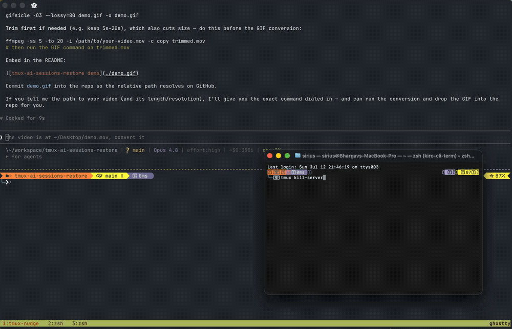
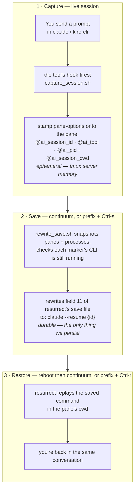
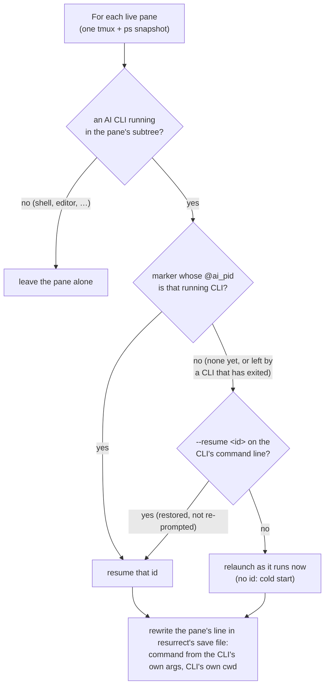
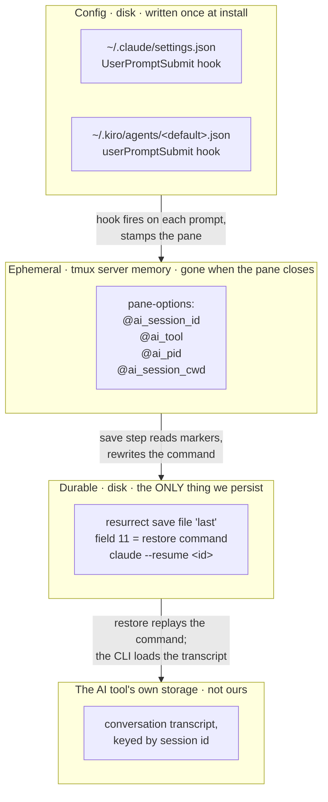

# tmux-ai-sessions-restore

Resume your **AI coding conversations** after a reboot — not just your tmux layout.

[tmux-resurrect](https://github.com/tmux-plugins/tmux-resurrect) +
[tmux-continuum](https://github.com/tmux-plugins/tmux-continuum) bring back your sessions,
windows, panes and working directories. But an AI CLI running in a pane comes back
**cold** — a brand-new, empty conversation. This plugin is the missing layer: it makes
`claude` and `kiro-cli chat` relaunch **resumed**, in the same pane, where you left off.

Supports **Claude Code** (`claude`) and **Kiro CLI** (`kiro-cli chat`).



```
reboot ─▶ resurrect/continuum restore panes + cwd ─▶ this plugin relaunches each
          AI pane as `--resume <id>` ─▶ you're back in the same conversation
```

## How it works



1. **Capture** — each tool's own prompt hook (Claude `UserPromptSubmit`, Kiro
   `userPromptSubmit`) runs *inside the pane*, so it knows `$TMUX_PANE`. On every prompt it
   stamps the live session id onto that pane as tmux pane-options (`@ai_session_id`,
   `@ai_tool`), plus `@ai_pid` — the pid of the CLI process that fired the hook. Capturing on
   a prompt (not session start) means a pane is only marked once its session actually has a
   transcript to resume, and after `/clear` or `/resume` the next prompt re-marks the pane
   with the new conversation. One-shot runs inside the pane (`claude -p`, `--bg`) are
   ignored. No change to how you launch the tools; nothing is written to disk by us.
2. **Save** — a `@resurrect-hook-post-save-layout` hook takes one snapshot of the panes and
   the process table and, for every pane with an AI CLI anywhere in its process subtree
   (so it sees through shell-integration wrappers like kiro-cli's `kiro-cli-term` or Amazon
   Q's figterm), rewrites that pane's command in resurrect's own save file to a resume
   command (`claude --resume <id>` / `kiro-cli chat --resume-id <id>`):
   - The id is the pane's marker **if the CLI that stamped it is still running there**. A
     marker left by a CLI that has since exited is ignored.
   - Otherwise it is the id on the running CLI's own command line — a restored pane you
     haven't typed in since still carries `--resume <id>`, so it survives further reboots.
   - The command is rebuilt from the running CLI's own arguments: your flags
     (`--dangerously-skip-permissions`, `--model …`) are kept, any old `--resume <id>` is
     replaced, and a first prompt given as an argument (`claude "fix the bug"`) is dropped
     rather than sent again. With no id, the pane is relaunched the way it runs now.
   - The pane is restored in the CLI's own working directory, which is where its
     conversation belongs (tmux reports a wrapper's directory instead).

   post-save-layout runs *before* resurrect points `last` at the new file, so killing the
   server mid-save can never leave `last` on a file that hasn't been rewritten.
3. **Restore** — resurrect replays that command unchanged, in that directory.

resurrect only re-runs a pane's saved command if it matches `@resurrect-processes`, so the
plugin also appends a relaxed match (`~claude`, `~kiro-cli`) to that option on load.
Without it, restore brings back your layout but every AI pane is just a bare shell.

Because the id is stamped per-pane, this is correct even with **many AI panes in the same
directory** — where "resume the latest conversation" would collapse them all onto one.

### How the save step decides (per pane)

The save hook walks every live pane and picks one of these outcomes. The argv branch is what
keeps an already-resumed pane resumable across *further* reboots with zero interaction; the
liveness check is what keeps a pane from coming back as an *older* conversation:



The same pass also undoes two tmux-resurrect save bugs that otherwise start the wrong thing
on restore: a pane with an empty title (Claude clears it on exit) gets its fields shifted by
one — restoring it in the wrong directory with some unrelated process's command — and
resurrect's ppid lookup can attach other panes' commands (including `claude --resume …`) to a
pane. Shifted lines are repaired, stray lines dropped, and an AI command recorded for a pane
that runs no AI CLI is cleared.

## Requirements

This is an **add-on layer — it does nothing on its own.** It rewrites entries in
tmux-resurrect's save file, so you need:

- [tmux-resurrect](https://github.com/tmux-plugins/tmux-resurrect) — **required** (owns the
  save file this plugin rewrites, and replays the resume command on restore)
- [tmux-continuum](https://github.com/tmux-plugins/tmux-continuum) — **required for the
  automatic reboot→restore experience**; without it you save/restore by hand with
  `prefix + Ctrl-s` / `prefix + Ctrl-r`
- tmux ≥ 3.0 (pane-level user options)
- `jq`
- `claude` and/or `kiro-cli` on your `PATH`

## Install (TPM)

```sh
curl -fsSL https://raw.githubusercontent.com/harnessed-ai/tmux-ai-sessions-restore/main/install.sh | bash
```

Or if you already have the repo cloned locally:

```sh
bash ~/path/to/tmux-ai-sessions-restore/install.sh
```

**TPM users** — inside tmux press **`prefix + I`** and you're done. TPM installs the plugin and registers the Claude/Kiro hooks automatically.

**Non-TPM / run-shell users** — source your config, then register the hooks manually:

```sh
tmux source ~/.config/tmux/tmux.conf   # or ~/.tmux.conf
# resolve wherever the plugin landed, then register the hooks:
DIR="$HOME/.tmux/plugins/tmux-ai-sessions-restore"
[ -d "$DIR" ] || DIR="$HOME/.config/tmux/plugins/tmux-ai-sessions-restore"
bash "$DIR/scripts/install_hooks.sh"
```

> **Where the plugin lives:** TPM installs into `~/.tmux/plugins/` when your config is
> `~/.tmux.conf`, but into `~/.config/tmux/plugins/` when your config is
> `~/.config/tmux/tmux.conf` (XDG). The snippet above resolves either. TPM users don't
> normally need this — the plugin registers the hooks itself on first load.

<details>
<summary>Manual install</summary>

Add to `~/.tmux.conf`. **Order matters: load this after resurrect but _before_ continuum** —
it must set `@resurrect-processes` before continuum starts its (backgrounded) auto-restore,
otherwise restore brings back your layout with bare shells.

```tmux
set -g @continuum-restore 'on'
set -g @plugin 'tmux-plugins/tmux-resurrect'
set -g @plugin 'harnessed-ai/tmux-ai-sessions-restore'
set -g @plugin 'tmux-plugins/tmux-continuum'

run '~/.tmux/plugins/tpm/tpm'
```

Then `prefix + I` to install.

</details>

### What this writes outside tmux (and how to opt out)

Unlike resurrect (which is pure tmux), this plugin needs a hook **inside each AI tool** to
learn a pane's session id. On first load it registers them for you (idempotent):

- `~/.claude/settings.json` — a `UserPromptSubmit` hook
- your default Kiro agent `~/.kiro/agents/kiro_default.json` — a `userPromptSubmit` hook
  (materialised from the built-in default agent if you don't already have one on disk)

Each hook only stamps a tmux pane-option and does nothing else. To manage it yourself
instead of letting the plugin do it:

```sh
set -g @ai-restore-auto-install 'off'   # in tmux.conf: disable auto-install on load
# DIR resolves to wherever the plugin was installed (see note above):
DIR="$HOME/.tmux/plugins/tmux-ai-sessions-restore"
[ -d "$DIR" ] || DIR="$HOME/.config/tmux/plugins/tmux-ai-sessions-restore"
bash "$DIR/scripts/install_hooks.sh"     # register the hooks manually
bash "$DIR/scripts/uninstall_hooks.sh"   # remove them anytime
```

> Already-running AI sessions are picked up the **next time you send a prompt** in them;
> sessions that were never captured fall back to a normal cold launch.

## Configuration

| Option | Default | Description |
| --- | --- | --- |
| `@ai-restore-enabled-tools` | `claude kiro` | Which tools to restore. |
| `@ai-restore-claude-command` | `claude` | Launch command for Claude, used when the running CLI's own command line can't be read. |
| `@ai-restore-kiro-command` | `kiro-cli chat` | Launch command for Kiro, likewise. |
| `@ai-restore-cold-fallback` | `on` | Append `\|\| <cold launch>` so an expired/invalid id starts a normal session instead of erroring. |
| `@ai-restore-auto-install` | `on` | Auto-register capture hooks on plugin load. |

Example:

```tmux
set -g @ai-restore-enabled-tools 'claude'
set -g @ai-restore-cold-fallback 'on'
```

## Verify it works

```sh
# 1. start an AI CLI in a pane and chat a little
claude            # or: kiro-cli chat

# 2. in another pane, confirm the live session was captured onto the pane
tmux show -p -t <that-pane> -v @ai_session_id      # prints a UUID

# 3. save, then check resurrect baked in a resume command
tmux run-shell ~/.tmux/plugins/tmux-resurrect/scripts/save.sh
grep -- '--resume' ~/.local/share/tmux/resurrect/last    # older resurrect: ~/.tmux/resurrect/last

# 4. kill the server and restore
tmux kill-server
tmux                     # continuum auto-restores, or: prefix + Ctrl-r
```

The AI pane should reopen already in your prior conversation.

To check a long-running workspace without touching anything, run the read-only diagnostic
from inside tmux. It reports the hook wiring, whether continuum is really auto-saving in this
server, how old the save a restore would use is, and pane by pane what that save would bring
back versus what a save now would write:

```sh
bash ~/.config/tmux/plugins/tmux-ai-sessions-restore/scripts/diagnose.sh   # or ~/.tmux/plugins/…
```

## Why this rides resurrect's storage



The plugin adds **no storage of its own**. During a session the mapping lives only as
ephemeral tmux pane-options (in the server's memory, gone when the pane closes). The only
durable artifact is the resume command written into **resurrect's existing save file**
(field 11, the per-pane "restored command"). resurrect replays it on restore *if* the
command matches `@resurrect-processes` — which is why the plugin adds `~claude`/`~kiro-cli`
to that option. After a restore the next prompt re-stamps the pane, so the mapping
regenerates every cycle and never needs to survive a reboot itself.

## Limitations

- A **brand-new** session is captured once you've **sent at least one prompt** in it after
  the hooks were installed; before that it has no transcript to resume and cold-starts.
- Switching conversations inside a running CLI (`/clear`, `/resume`) is picked up on the
  **next prompt** there; a save taken before that still names the previous conversation.
- Arguments are recovered from `ps`, which loses quoting: an option value containing spaces
  (`--append-system-prompt "be terse"`) is not restored intact (resurrect has the same limit).
- Kiro's `--no-interactive` mode does not fire the prompt hook; interactive `kiro-cli chat`
  (the normal usage) does.
- After a restore, a resumed pane's marker is empty until its next prompt — but the save
  step **recovers the session id from the resumed CLI's own `--resume <id>` arguments**, so
  an already-resumed pane stays resumable across further reboots *even with zero interaction
  since restore*. (Only a genuinely cold-started or never-used session lacks an id to
  recover.) So continuum recording "current reality" no longer downgrades untouched panes.
- Not handled: other AI CLIs, remote/SSH tmux, nested tmux.

## Troubleshooting

**Restore brings back your layout but every pane is a bare shell, and nothing seems
loaded.** Your terminal probably starts tmux with a minimal `PATH` that doesn't include
your tmux/CLI install dir (common with **Ghostty/iTerm launched via launchd + Homebrew**,
where `PATH` is just `/usr/bin:/bin:…`). tmux's `run-shell` plugin loaders then can't find
the `tmux` binary and fail silently, so resurrect/continuum/this plugin never load. Fix it
by giving the tmux server a real `PATH` *before* the plugin `run-shell` lines:

```tmux
set-environment -g PATH "/opt/homebrew/bin:/usr/local/bin:/usr/bin:/bin:/usr/sbin:/sbin:$HOME/.local/bin"
```

(or launch tmux through a login shell, e.g. Ghostty `command = /bin/zsh -lc "exec tmux new-session -A -s main"`).
Verify with: `tmux run-shell 'command -v tmux'` — it must print a path, not nothing.

**Assistant runs behind a shell-integration wrapper** (e.g. kiro-cli / Amazon Q's
`*-term` pty). The plugin detects the assistant via the pane's process *subtree*, so this
works — but if you see panes that should be assistants restore cold, confirm the assistant
is a descendant of the tmux pane's process (`#{pane_pid}`), not a detached terminal.

**A restore brings back an old layout / old conversations everywhere.** Check that
continuum is actually saving: `scripts/diagnose.sh` warns if it isn't. continuum only turns
auto-save on when it sees no *other* tmux server while this one starts — several terminal
windows or tabs each launching tmux at login can trip that check — and then it stays off
for the whole life of that server, so `last` keeps pointing at whatever an earlier server
saved. Restart tmux from a single terminal, or save by hand (`prefix + Ctrl-s`) before
killing the server.

## Tests

```sh
bash tests/plan_test.sh        # per-pane decisions (stubbed ps / tmux input)
bash tests/rewrite_test.sh     # save-file rewrite + resurrect bug repairs
bash tests/entrypoint_test.sh  # hook wiring and migration (private tmux server)
bash tests/roundtrip_test.sh   # rewrite_save.sh on real panes (private tmux server)
bash tests/adversarial_restore_test.sh   # full save → kill-server → restore, twice
```

The adversarial test drives 40 panes through the real tmux-resurrect save/restore with fake
`claude` / `kiro-cli` binaries (it needs a C compiler and tmux-resurrect). Every test uses
its own `tmux -L` server and scratch directories — but don't restart your real tmux server
while one runs, or continuum will see the test server and leave auto-save off.

## Uninstall

```sh
# resolve wherever the plugin landed, then remove the Claude/Kiro capture hooks:
DIR="$HOME/.tmux/plugins/tmux-ai-sessions-restore"
[ -d "$DIR" ] || DIR="$HOME/.config/tmux/plugins/tmux-ai-sessions-restore"
bash "$DIR/scripts/uninstall_hooks.sh"
```

Then remove the `@plugin` line and restart tmux to drop the resurrect save hook.
